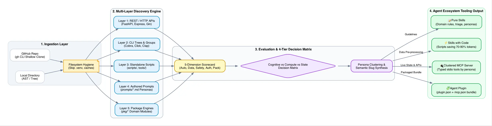

# Montage 🎞️

**Agent Ecosystem Readiness Assessor & Tooling Scaffolder (CLI + MCP Server)**

Montage reviews applications and codebases to evaluate their readiness for the autonomous AI agent ecosystem, scoring them across five core architectural dimensions and generating blueprints for **Pure Skills**, **Skills with Code**, **Model Context Protocol (MCP) servers**, and **Agent Plugins**.



---

## 📖 Documentation & Architecture

* 🌐 **[Documentation Site](https://ghchinoy.github.io/montage/):** Complete Astro Starlight documentation site with Catppuccin Latte theme.
* 📘 **[User & Operator Guide](docs/user-guide.md):** Guide to CLI commands, GitHub ingestion, interpreting scorecards, and using scaffolded tooling.
* 🏛️ **[Skills Assessor Architecture & Theory](docs/skills-assessor-architecture.md):** Deep dive into the multi-layer discovery engine, 4-tier decision matrix, token economics, and persona clustering.

---

## ✨ Features

- **Multi-Source Ingestion:** Analyzes local project directories or fetches public GitHub repositories directly via GitHub CLI (`gh`).
- **Capability-Centric Decomposition:** Deconstructs applications into fine-grained capabilities across REST/HTTP APIs (FastAPI, Express, Gin), hierarchical CLI command trees (Cobra, Click, Clap), standalone scripts, authored sub-agent prompts (`prompts/*.md`), and engine packages (`pkg/*`).
- **5-Dimension Readiness Scorecard:**
  1. 🤖 **Interface Automation (25%):** Non-interactive CLI commands, REST endpoints, and scriptable interfaces.
  2. 📄 **Data Interchange (20%):** Structured serialization (`--json`, YAML) and clean stdout/stderr stream separation.
  3. 🛡️ **Execution Safety (20%):** Mutation boundaries, pre-flight `--dry-run` simulation, and dangerous action gating.
  4. 🔑 **Auth & Configuration (15%):** Headless environment variable and config file detection without blocking TTY prompts.
  5. 📦 **Runtime & Packaging (20%):** Self-contained binaries, containerization, and dependency portability.
- **Agent Ecosystem Spectrum & Multi-Skill Blueprints:**
  - 📝 **Pure Skills:** Domain rules, advisory review procedures, and authored sub-agent personas requiring zero runtime dependencies.
  - ⚡ **Skills with Code:** Workflow instructions paired with deterministic scripts to filter raw data and reduce LLM token usage by 60–90%.
  - 🔌 **Clustered MCP Servers:** Stdio Model Context Protocol servers with tools organized by operational personas.
  - 🧩 **Agent Plugins:** Turn-key packages adhering to the [Agent Plugins Specification](https://github.com/agentplugins/agent-plugins-spec) (`plugin.json`, `mcp.json`, and specialized `skills/`).
- **Actionable Gap Analysis:** Specific remediation steps and code snippets to upgrade applications into agent-native tools.
- **AI-Enriched Guidance:** Optional strategic analysis via Gemini (`gemini-2.5-flash` or Google Cloud Vertex AI).
- **Built-in MCP Server:** Exposes `assess_repository`, `evaluate_readiness`, and `scaffold_tooling` over `stdio`.

---

## 📋 Prerequisites

1. **Git** (Required for shallow cloning repositories)
2. **Go 1.25+** (To build from source)
3. **GitHub Access (Zero-Config for Public Repositories):**
   - **Public Repositories:** Work out-of-the-box with **zero authentication** via GitHub Public REST API and anonymous `git clone`. No login required (ideal for Cloud Run).
   - **Optional `GITHUB_TOKEN`:** Set `GITHUB_TOKEN=ghp_...` (or `GH_TOKEN`) to increase rate limits to 5,000 req/hour or access private repositories.
   - **Local GitHub CLI (`gh`):** If authenticated locally via `gh auth login`, Montage automatically uses ambient credentials.
4. **Gemini API Key or Google Cloud Vertex AI [Optional for AI enrichment]**
   - **Gemini Developer API:**
     ```bash
     export GEMINI_API_KEY="your-gemini-api-key"
     ```
   - **Google Cloud Vertex AI:**
     ```bash
     export GOOGLE_CLOUD_PROJECT="your-project-id"
     export GOOGLE_CLOUD_LOCATION="global"
     ```

---

## 🚀 Installation & Build

```bash
git clone https://github.com/ghchinoy/montage.git
cd montage
make build
# Binary is compiled to ./bin/montage
```

Run test suite:
```bash
make test
make vet
```

---

## 🌐 Web Application & Cloud Run Deployment

Montage includes a built-in Lit WebComponent dashboard. Enter any repository and click **"Make this part of the Agent Economy"** to view interactive scorecards, filterable capability matrices, and download full `.zip` agent scaffolding bundles.

### Run Locally
```bash
# Start the web dashboard on http://localhost:8080
./bin/montage serve --port 8080
```
Or for frontend development with live HMR:
```bash
# Terminal 1: Backend API
./bin/montage serve --port 8080

# Terminal 2: Vite Dev Server
cd ui && npm run dev
# Open http://localhost:5173
```

### Deploy to Google Cloud Run
Deploy Montage to Google Cloud Run with a single command using the included multi-stage `Dockerfile`:
```bash
gcloud run deploy montage \
  --source . \
  --region us-central1 \
  --allow-unauthenticated \
  --set-env-vars GOOGLE_GENAI_USE_VERTEXAI=true,GOOGLE_CLOUD_PROJECT=your-project-id \
  --memory 1Gi \
  --cpu 1
```

---

### 1. Review a Local Codebase
```bash
montage review /path/to/project --out ./out
```

### 2. Review a GitHub Repository Directly
```bash
montage review https://github.com/ghchinoy/repotographer --out ./out
# Or shorthand:
montage review ghchinoy/repotographer --out ./out
```

**Generated Outputs in `./out`:**
- `MONTAGE_ASSESSMENT.md`: Detailed markdown report with executive scorecard, dimension analysis, artifact blueprints, and code remediation examples.
- `montage.json`: Complete machine-readable assessment dataset.

### 3. Review and Scaffold Agent Tooling in One Step
```bash
montage review ghchinoy/repotographer --scaffold --out ./out
```

**Scaffolded Artifacts:**
- `plugins/<name>/plugin.json`: Agent Plugin manifest.
- `plugins/<name>/mcp.json`: MCP stdio server definition.
- `plugins/<name>/skills/<name>/SKILL.md`: Autonomous agent instructions and workflow.
- `skills/<name>/SKILL.md`: Standalone skill ready for `.agents/skills`.
- `cmd/<name>-mcp/main.go`: Go MCP server starter registering candidate tools.

---

## 🤖 MCP (Model Context Protocol) Server

Run Montage as an MCP server over `stdio` to empower coding agents (Claude Desktop, OpenCode, Cursor, Antigravity) with repository assessment capabilities:

```bash
montage mcp
```

### Exposed MCP Tools

| Tool | Parameters | Description |
|---|---|---|
| `assess_repository` | `target` (string, required)<br>`scaffold` (bool)<br>`use_llm` (bool)<br>`out_dir` (string) | Ingests a local path or GitHub repo, scores readiness, produces reports, and optionally scaffolds artifacts. |
| `evaluate_readiness` | `target` (string, required) | Fast in-memory evaluation returning 5 dimension scores, tier, and gap analysis without disk side effects. |
| `scaffold_tooling` | `target` (string, required)<br>`out_dir` (string) | Scaffolds the complete `plugins/`, `skills/`, and MCP server starter structure for an assessed target. |

### Generate Client Configurations

```bash
# Print formatted configuration for OpenCode
montage mcp config --client opencode

# Print formatted configuration for Claude Desktop
montage mcp config --client claude

# Print formatted configuration for Cursor
montage mcp config --client cursor
```

Example for OpenCode (`opencode.json`):
```json
{
  "mcpServers": {
    "montage": {
      "command": "/path/to/montage/bin/montage",
      "args": ["mcp"]
    }
  }
}
```

---

## 🧩 Agent Plugin & Skill Integration

Montage includes its own official agent plugin in `plugins/montage`:
- `plugins/montage/plugin.json`: Plugin manifest.
- `plugins/montage/mcp.json`: MCP stdio server definition.
- `plugins/montage/skills/montage/SKILL.md`: Workflow skill for coding agents.

---

## 📄 License

Licensed under the Apache License, Version 2.0.
