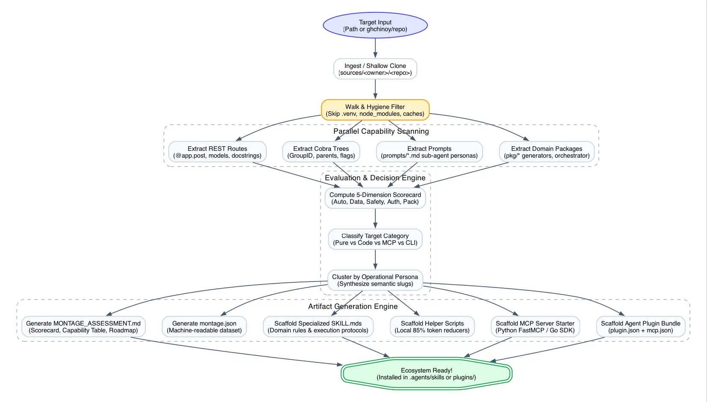

# Montage Skills Assessor & Evaluation Architecture

Montage is an automated capability assessment and scaffolding engine. It inspects existing codebases, decomposes them into discrete functional capabilities, evaluates their readiness for autonomous AI agents, and maps them to the **Agent Ecosystem Spectrum**: **Pure Skills**, **Skills with Code**, **Model Context Protocol (MCP) Servers**, and **Agent Plugins**.


---

## 1. System Philosophy: Beyond Monolithic Wrapping

A common anti-pattern in early agent integration is **Monolithic 1:1 Wrapping**: taking an entire application repository and wrapping it into a single generic skill (e.g., `app-guide`) and a single massive MCP server containing dozens of unrelated tools.

Monolithic wrapping creates severe problems for autonomous agents:
* **Context Window Bloat:** Dumping 20+ tool schemas into an agent's system prompt consumes thousands of tokens per turn before any reasoning begins.
* **Math & Aggregation Hallucinations:** When agents are forced to ingest raw logs, histories, or multi-row datasets directly into prompts, they frequently miscalculate deltas, miss edge cases, and blow through token limits.
* **Loss of Editorial & Policy Nuance:** Procedural and advisory modes (e.g., academic review, clinical triage, editorial copywriting) get lost when forced into blind executable tools.

### The Montage Principle: Capability Deconstruction & Persona Clustering

Montage replaces monolithic wrapping with **Capability-Centric Decomposition**:
1. **Deconstruct:** The repository is parsed into fine-grained functional primitives across REST APIs, CLI trees, standalone scripts, authored sub-agent prompts, and engine packages.
2. **Classify:** Each capability is evaluated against a decision matrix to determine whether it is best suited as a **Pure Skill**, a **Skill with Code**, an **MCP Tool**, or a **CLI Tool**.
3. **Cluster:** Capabilities are grouped by **operational persona** (e.g. *Advisory Review*, *Source Analysis*, *Clinical Telemetry*, *Typesetting*).
4. **Scaffold:** Montage synthesizes domain-focused `SKILL.md` documents, token-saving local scripts, and typed MCP servers.

---

## 2. End-to-End Pipeline Architecture

The Montage evaluation and generation pipeline executes across five sequential phases:



```
┌────────────────────────────────────────────────────────────────────────────────────────┐
│                                MONTAGE PIPELINE PHASES                                 │
├────────────────────┬───────────────────────────────────────────────────────────────────┤
│ Phase 1: Ingestion │ Local directory walk or shallow clone from GitHub CLI (`gh`).     │
│                    │ Strict exclusion of `.venv`, `site-packages`, and build artifacts.│
├────────────────────┼───────────────────────────────────────────────────────────────────┤
│ Phase 2: Discovery │ Multi-layer AST and regex scanning: REST routes, CLI trees,       │
│                    │ standalone scripts, authored prompt personas, and engine packages.│
├────────────────────┼───────────────────────────────────────────────────────────────────┤
│ Phase 3: Evaluation│ 5-Dimension readiness scoring + 4-Tier decision matrix mapping     │
│                    │ capabilities to Pure Skills, Skills with Code, or MCP Tools.     │
├────────────────────┼───────────────────────────────────────────────────────────────────┤
│ Phase 4: Clustering│ Grouping capabilities into cohesive operational personas;         │
│                    │ synthesizing semantic slugs and multi-skill blueprints.           │
├────────────────────┼───────────────────────────────────────────────────────────────────┤
│ Phase 5: Generation│ Emitting `MONTAGE_ASSESSMENT.md`, `montage.json`, specialized     │
│                    │ `SKILL.md` files, helper scripts, and clustered MCP servers.      │
└────────────────────┴───────────────────────────────────────────────────────────────────┘
```

---

## 3. The Multi-Layer Discovery Engine (`internal/analyzer`)

Montage's analyzer performs structural inspection across five architectural layers:

### Layer 1: REST & HTTP APIs
* **Engines Recognized:** FastAPI, Flask, Express, NestJS, and Gin.
* **Extraction Primitives:**
  - Route paths (`@app.get("/health")`, `@app.post("/analyze_weights")`)
  - HTTP verbs (`GET`, `POST`, `PUT`, `DELETE`)
  - Request models (Pydantic `AnalysisRequest`, `BioGenerationRequest`)
  - Response models (`AnalysisResponse`, `BioGenerationResponse`)
  - Route docstrings and summaries
* **Why it matters:** Web applications (like `kitten-haven`) often expose their most powerful capabilities via REST endpoints rather than CLIs.

### Layer 2: Hierarchical CLI Trees & Command Groups
* **Engines Recognized:** Cobra (Go), Click (Python), Argparse (Python), Clap (Rust), and Commander (Node).
* **Extraction Primitives:**
  - Command groups: Detects `rootCmd.AddGroup(...)` and maps group IDs (`execution`, `management`, `discovery`, `system`).
  - Hierarchical command paths: Resolves parent-child relationships (e.g., `project create`, `project source add`, `template search`) rather than naked verbs (`create`, `add`, `search`).
  - Flag safety: Detects `--json`, `--output`, `--format`, `--dry-run`, `--non-interactive`.

### Layer 3: Standalone Utility Scripts
* **Scanning Scope:** Inspects `scripts/`, `tools/`, and `bin/` for `.py`, `.sh`, `.ts`, and `.go` files.
* **Extraction Primitives:** Reads header docstrings, input parameter conventions, and mutation profiles (e.g. `list_kittens.py` vs `set_role.py`).

### Layer 4: Authored Sub-Agent Prompts
* **Scanning Scope:** Walks `prompts/`, `pkg/prompts/`, and `.prompts/` for `.md` files.
* **Extraction Primitives:** Identifies author-crafted personas (`"You are Syntaxis Reviewer, an expert academic editor..."`), advisory rules, review rubrics, and structural constraints.
* **Why it matters:** In multi-agent applications (like `syntaxis`), these prompts represent pre-engineered agent skills that should be promoted directly to Pure Skills.

### Layer 5: Architectural Package Engines
* **Scanning Scope:** Evaluates direct packages under `pkg/` or `internal/`.
* **Domain Recognition:** Maps domain engines (`generators`, `orchestrator`, `registry`, `classifier`, `a2api`).
* **Plumbing Filter:** Intentionally suppresses internal infrastructure (`config`, `models`, `storage`, `theme`, `logger`) to prevent low-level noise in the agent's skill catalog.

### Filesystem Hygiene
The walker explicitly ignores virtual environments and transient caches:
```go
skipDirs := map[string]bool{
    ".git": true, "node_modules": true, "vendor": true, "dist": true,
    "build": true, ".astro": true, ".next": true, "sources": true,
    "bin": true, "obj": true, ".cache": true, ".venv": true,
    "venv": true, "env": true, "__pycache__": true, ".pytest_cache": true,
    ".ruff_cache": true, "site-packages": true, ".tox": true,
}
```
This guarantees that 3rd-party library environment variables (such as CFFI or Pytest variables) never pollute the application assessment.

---

## 4. The 4-Tier Decision Matrix (`internal/evaluator`)

Every discovered capability is evaluated against Montage's architectural decision criteria:

```
                                  Capability Evaluated
                                           │
             ┌─────────────────────────────┼─────────────────────────────┐
             ▼                             ▼                             ▼
   Does it require domain       Does it process massive       Does it query live state,
  judgment, review rubrics,       raw data, logs, CSVs,        mutate a database, or
   or human-like guidelines?     or mathematical trends?        call a live REST API?
             │                             │                             │
             ▼                             ▼                             ▼
     [ PURE SKILL ]              [ SKILL WITH CODE ]               [ MCP TOOL ]
  Natural language only;       Bundles a local helper script;   Strict JSON schemas over stdio;
  zero code dependencies       crunches data to save 85% tokens  real-time stateful interaction
```

### Classification Criteria:

| Target Artifact | Core Characteristic | When Selected | Architectural Value |
|---|---|---|---|
| **📝 Pure Skill** | **Cognitive & Policy-Driven** | • Advisory or review tasks that preserve author intent.<br>• Clinical, veterinary, or legal checklists.<br>• Authored prompt personas (`pkg/prompts/*.md`).<br>• Style and editorial standards. | Requires zero runtime dependencies; provides behavioral guardrails directly to the LLM. |
| **⚡ Skill with Code** | **Context & Token Optimizer** | • Analyzes historical logs, telemetry, or large datasets.<br>• Pre-filters code ASTs or CSV rows.<br>• Mathematical trend calculations (e.g. weight velocity, growth delta). | Eliminates prompt context bloat; achieves **70–90% token savings** by running local compute. |
| **🔌 MCP Tool** | **Live State & Transactional** | • Direct database / Firestore CRUD.<br>• Invokes live REST endpoints or compilation pipelines.<br>• Requires strict JSON schema validation.<br>• Clear Read-Only vs. Mutating demarcation. | Provides deterministic, type-safe execution over `stdio` with client confirmation support. |
| **💻 CLI Tool** | **System & Infrastructure** | • Server listeners, daemons (`serve`).<br>• Administrative credential and role management. | Preserved as shell-executable commands for operator workflows. |

---

## 5. Token Economics: Why "Skill with Code" Matters

A critical contribution of Montage's architecture is quantifying the token cost of data-heavy capabilities.

### The Problem: Raw Context Pollution
Consider a foster litter of 5 kittens weighed twice daily over 4 weeks:
* $5 \text{ kittens} \times 2 \text{ weights/day} \times 28 \text{ days} = 280 \text{ timestamped records}$.
* In raw JSON format, 280 records consume approximately **~6,000–8,000 tokens**.
* Feeding this raw array into an LLM context window costs money, adds latency, and frequently causes math hallucinations when calculating rate-of-gain.

### The Solution: Deterministic Pre-Processing
Montage classifies `/analyze_weights` as a **Skill with Code**:
1. A bundled 30-line Python helper script (`scripts/clinical_telemetry_growth_helper.py`) crunches the raw records locally.
2. It computes:
   - 24-hour delta
   - 7-day velocity
   - Weight stall indicators
3. It emits a compact, 3-line structured summary:
   ```json
   {
     "status": "warning",
     "delta_24h_grams": -18,
     "message": "Critical weight drop detected: -18g in 24 hours."
   }
   ```
4. **Token Consumption:** Reduced from 7,500 tokens to **~65 tokens (99% reduction)**.
5. The LLM receives the summary and applies the **Pure Skill** clinical rules (*"If drop > 10g, initiate supplemental feeding and alert veterinarian"*).

---

## 6. Persona Clustering & Semantic Mapping

To prevent generating unmanageable tool lists, Montage clusters capabilities into **operational personas**:

### Persona Cluster Examples:

#### Syntaxis (Academic Publication Engine)
* **Advisory Review Persona (`syntaxis-advisory-reviewer`):** Combines `cmd/review.go` and `pkg/prompts/reviewer.md`.
* **Source Analysis Persona (`syntaxis-source-analyst`):** Combines `pkg/classifier` and `pkg/prompts/*analyst.md`.
* **Multi-Modal Generation Persona (`syntaxis-multi-modal-visualizer`):** Combines `pkg/generators/` (Graphviz DOT, Gonum, Gemini Image).
* **Typesetting Persona (`syntaxis-typst-typesetter`):** Combines `cmd/template.go` and `pkg/registry/typst.go`.
* **Orchestration Persona (`syntaxis-publication-orchestrator`):** Combines `cmd/project.go` and `cmd/execute.go`.
* **Interoperability Persona (`syntaxis-a2a-bridge`):** Combines `pkg/a2api/` (A2A Protocol v1.0).

#### Kitten Haven (Foster Care App)
* **Clinical Triage Persona (`kitten-haven-growth-triage`):** Combines `/health`, `/analyze_weights`, and neonatal clinical protocols.
* **Adoption Copywriter Persona (`kitten-haven-adoption-copywriter`):** Combines `/generate_adoption_bio` and editorial guidelines.
* **Shelter Security Persona (`kitten-haven-shelter-administration-security`):** Combines `set_role.py` and `verify_rules.py`.

---

## 7. The 5-Dimension Readiness Scorecard

Montage calculates an overall **Agent Readiness Score (0–100)** using weighted dimensional analysis:

$$\text{Overall Score} = 0.25 D_1 + 0.20 D_2 + 0.20 D_3 + 0.15 D_4 + 0.20 D_5$$

### Dimension Rubric:

| Dimension | Weight | Criteria Checked |
|---|---|---|
| **$D_1$: Interface Automation** | 25% | Presence of non-interactive CLI commands, REST endpoints, or scriptable interfaces. Zero blocking TTY prompts. |
| **$D_2$: Data Interchange** | 20% | Structured serialization (`--json`, YAML, Pydantic) vs. unstructured text. Separation of data (stdout) and logs (stderr). |
| **$D_3$: Execution Safety** | 20% | Clear demarcation between read-only and mutating actions. Support for `--dry-run`, validation passes, and idempotency. |
| **$D_4$: Auth & Configuration** | 15% | Headless configuration support: environment variables, config files, or ambient CLI auth (`gh`, `gcloud`, AWS CLI). |
| **$D_5$: Runtime & Packaging** | 20% | Self-contained packaging (single binary in Go/Rust, container, or clean package manifests). |

### Maturity Tiers:
* **Tier 5: Agent-Native (90–100):** Immediate Agent Plugin and MCP wrapping ready.
* **Tier 4: Agent-Capable (75–89):** Well-structured interfaces; minor gaps in dry-run or non-interactive flags.
* **Tier 3: Scriptable (55–74):** Functional CLI/scripts; best paired with a *Skill with Code*.
* **Tier 2: Workflow-Only (35–54):** Procedural or library code; recommended for a *Pure Skill*.
* **Tier 1: Manual / GUI-Bound (<35):** Requires refactoring to expose programmatic interfaces.

---

## 8. Artifact Scaffolding Engine (`internal/scaffold`)

When invoked with `--scaffold`, Montage generates turn-key ecosystem tooling adhering to official specifications:

1. **`plugin.json`**: Conforms to [Agent Plugins Specification 1.0.0](https://github.com/agentplugins/agent-plugins-spec).
2. **`mcp.json`**: Declares `stdio` server invocation command and arguments.
3. **`skills/<name>/SKILL.md`**: Generates specialized Markdown skill files containing:
   - YAML frontmatter with `name`, `description`, `license`, `metadata.kind`, and `metadata.domain`.
   - Core capabilities covered.
   - Workflow guidelines and decision rules.
   - Agent execution protocols (pre-flight validation, token efficiency, safety review).
4. **Helper Scripts (`scripts/`)**: Scaffolded starter scripts for Skills with Code.
5. **MCP Server Starters**:
   - Python: Generates `mcp_server.py` using `FastMCP` with tools grouped by persona.
   - Go: Generates `cmd/<app>-mcp/main.go` using `github.com/modelcontextprotocol/go-sdk/mcp`.
